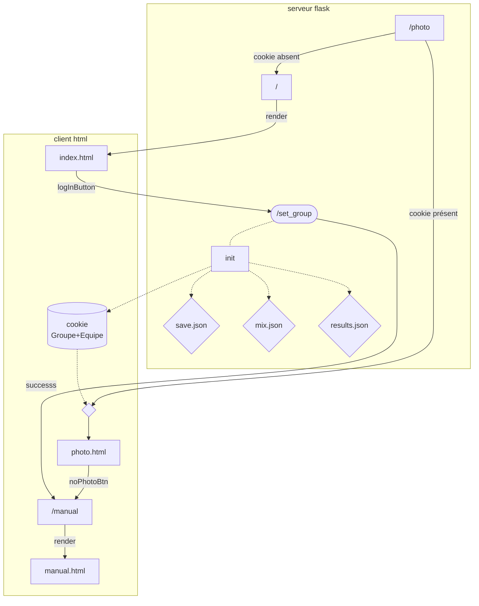

=== mix

=== Machine à état des pages

=== dev

Dans le local "serveur2"

 - git pull
 Si pb et tu veux pas garder tes modifs 
      - git reset --hard

 - tu travailles
 - git add .
 - git commit -m"message ;;; "
 - git push

 Là github est à jour mais pas le serveur

    - ssh user@srv-geitp -p2222 "cd /var/www/html; git pull"

    